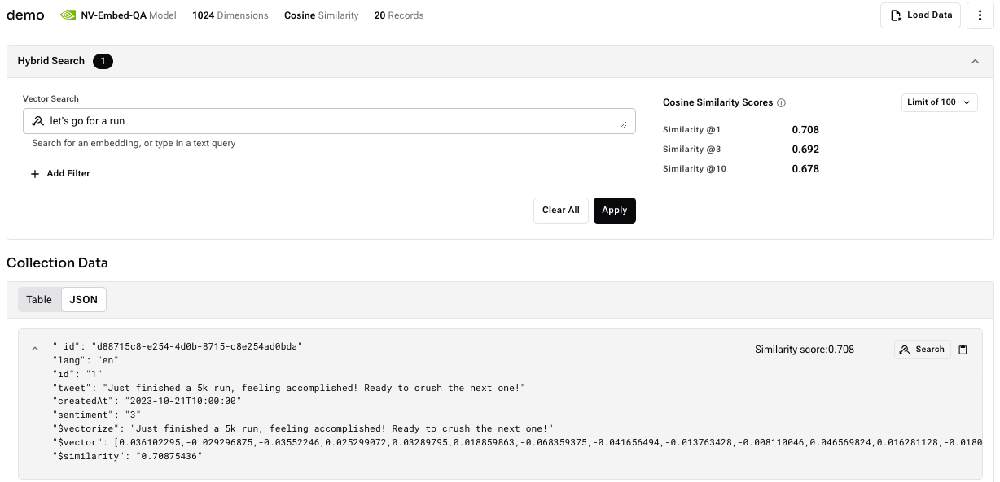

# Integrating Astra Streaming and Astra DB Vector Search

This guide provides step-by-step instructions to configure, deploy, and run an Apache Pulsar function that processes JSON data such as tweets, vectorizes them, and stores them in Astra DB, leveraging Astra DB's vector search capability.  
The function is generic and can be used with any kind of JSON data. The JSON field used for vectorization is configurable. This function connects the real-time data streaming world with Astra DB's vector search.

---

## Prerequisites

Before starting, ensure the following prerequisites are in place:

1. **Astra DB Vector Database**: Follow the instructions below to set up your Astra DB.
2. **Astra Streaming Tenant**: Set up Astra Streaming for Pulsar integration.
3. **Using Pulsar Binaries with Astra Streaming**: Required to create a topic, set the schema, and deploy the function.

---

## 1. Set up Astra DB Vector Database and Generate Token

To set up the vector database and retrieve necessary configurations:

1. **Create an Astra DB Vector Database**:
   - Log in to the [DataStax Astra](https://astra.datastax.com) dashboard.
   - Click on **Create Database** and select the **Serverless (Vector)** deployment type.
   - Provide a **Database Name** and **Region**.
   - After creation, wait for the status to become **Active**.

2. **Generate a Token**:
   - In the **Database Details** section, click **Generate Token** and copy the generated token securely.
   - The token will be used to authenticate API requests.

3. **Retrieve Astra DB API Endpoint**:
   - Go to **Database Details**.
   - Copy the **API endpoint**, which follows the format:
     ```
     https://ASTRA_DB_ID-ASTRA_DB_REGION.apps.astra.datastax.com
     ```

---

## 2. Set up Astra Streaming Tenant

Astra Streaming is powered by Apache Pulsar, allowing you to process data in real-time.

1. **Create an Astra Streaming Tenant**:
   - In the Astra Portal navigation menu, click **Streaming**.
   - Click **Create Tenant**, provide a **tenant name**, select your **provider** and **region**, then click **Create**.

2. **Download Tenant Configuration**:
   - In the **Connect** tab of your tenant, download the `client.conf` file.
   - If you're using Pulsar CLI, save it in the `conf` folder of your Pulsar installation to configure Pulsar CLI for your tenant.

---

## 3. Using Pulsar Binaries with Astra Streaming

Astra Streaming runs Apache Pulsar™. The benefits of open-source Pulsar are also available in Astra Streaming.

### Download a Compatible Pulsar Artifact

Astra Streaming is compatible with Pulsar 2.10. To get started:

```bash
PULSAR_VERSION="2.10.PATCH"
wget https://archive.apache.org/dist/pulsar/pulsar-$PULSAR_VERSION/apache-pulsar-$PULSAR_VERSION-bin.tar.gz
```

### Extract the Artifact:

```bash
tar xvfz apache-pulsar-$PULSAR_VERSION-bin.tar.gz
```

### Configure Binaries for Astra Streaming

Each tenant in Astra Streaming has a custom configuration. To configure Pulsar binaries for Astra Streaming:

1. **Download the `client.conf`**:
   - In the Astra Portal, go to **Streaming** and select your tenant.
   - Click the **Connect** tab and download the `client.conf`.

2. **Save the Configuration**:
   - Save the file in the `conf` directory of your Pulsar installation to overwrite the default `client.conf`.

### Pulsar Binaries Overview

- **`./bin/pulsar-admin`**: Administrative commands for managing namespaces, topics, functions, connectors, etc.
- **`./bin/pulsar-client`**: Commands for producing and consuming messages.

For a full reference, see [Pulsar’s CLI documentation](https://pulsar.apache.org/docs/en/pulsar-admin/).

---

## 4. Create the Topic

To create a topic for streaming tweets:

```bash
../apache-pulsar-2.10.6/bin/pulsar-admin topics create persistent://streaming-demo/default/tweets-topic
```

---

## 5. Define a JSON Schema for the Topic

Before deploying the function, define the schema for the `tweets-topic` in Pulsar:

```bash
../apache-pulsar-2.10.6/bin/pulsar-admin schemas upload \
  persistent://streaming-demo/default/tweets-topic \
  --filename /path/to/tweet-schema.json
```

The schema should match the format of the JSON data you're ingesting.

---

## 6. Deploy the Pulsar Function on Astra Streaming

Once the schema is in place, deploy your Pulsar function to Astra Streaming. You can find the function in the [release section of this repository](https://github.com/difli/astra-streaming-vectorize-function/releases/tag/v1.0). Below is the configuration required for your function.

### Function Configuration: `function-config.yaml`

```yaml
jar: /path/to/your/astra-streaming-vectorize-function-0.0.1-SNAPSHOT.jar  # Path to your function JAR
className: com.datastax.se.VectorizeFunction                # Fully qualified class name of the function
parallelism: 1                                                 # Number of instances
inputs:
  - persistent://streaming-demo/default/tweets-topic           # Input topic
output: ""                                                     # Output topic (optional)
autoAck: true                                                  # Automatic acknowledgment
tenant: streaming-demo                                         # Pulsar tenant name
namespace: default                                             # Namespace
name: vectorize-function                                       # Function name
logTopic: ""                                                   # Log topic (optional)
userConfig:
  ASTRA_DB_API_ENDPOINT: "<your-api-endpoint>"
  ASTRA_DB_APPLICATION_TOKEN: "<your-token>"
  ASTRA_DB_COLLECTION: "demo"
  ASTRA_DB_KEYSPACE: "default_keyspace"
  ASTRA_DB_VECTORIZE_SERVICE: "nvidia"
  ASTRA_DB_VECTORIZE_MODEL: "NV-Embed-QA"
  ASTRA_DB_VECTOR_DIMENSION: "1024"
  ASTRA_DB_VECTORIZE_FIELD: "tweet"
  logging_level: DEBUG
```

### Deploy the Function

To deploy your Pulsar function on Astra Streaming, use the following command:

```bash
../apache-pulsar-2.10.6/bin/pulsar-admin functions create --function-config-file /path/to/function-config.yaml
```

---

## 7. Ingest Data into Astra Streaming

The following Python script ingests JSON-based tweet data into Astra Streaming. 

### Python Script: `ingest_tweets.py`

```python
import pulsar
from pulsar.schema import Record, String, Integer, JsonSchema
import json

# Replace with your Pulsar service URL and token (keep the token secure)
PULSAR_SERVICE_URL = 'pulsar+ssl://<astra-streaming-service-url>'
TOPIC = "persistent://streaming-demo/default/tweets-topic"
AUTH_TOKEN = "<your-auth-token>"

# Define the JSON schema as a class
class TweetData(Record):
    lang = String()
    id = String()
    tweet = String()
    createdAt = String()
    sentiment = Integer()

# Create a Pulsar client
client = pulsar.Client(PULSAR_SERVICE_URL, authentication=pulsar.AuthenticationToken(AUTH_TOKEN))

# Create a producer with the specified JSON schema
producer = client.create_producer(
    TOPIC,
    schema=JsonSchema(TweetData)
)

# Open and read the JSON file containing multiple tweet objects
with open('data.json', 'r') as file:
    tweet_data_list = json.load(file)

# Iterate over each tweet object in the JSON array
for tweet_data in tweet_data_list:
    try:
        # Create a message that adheres to the schema
        message = TweetData(
            lang=tweet_data.get("lang", ""),
            id=tweet_data.get("id", ""),
            tweet=tweet_data.get("tweet", ""),
            createdAt=tweet_data.get("createdAt", ""),
            sentiment=tweet_data.get("sentiment", 0)
        )

        # Produce the JSON message directly
        producer.send(message)
        print(f"Message sent successfully for tweet ID: {tweet_data['id']}")

    except Exception as e:
        print(f"Failed to send message for tweet ID: {tweet_data.get('id')} due to error: {e}")

# Close the producer and client
producer.close()
client.close()

print("All JSON messages produced successfully.")
```

### Instructions:

1. **Configure Service URL and Token**:
   - Replace `<astra-streaming-service-url>` and `<your-auth-token>` with your Astra Streaming service URL and token.

2. **Place the JSON File**:
   - The script reads tweet data from `data.json`. Ensure it exists in the same directory, or modify the path in the script.

3. **pulsar-client Python package**:
   - Ensure you have the pulsar-client Python package installed:
     ```bash
     pip install pulsar-client
     ```
4. **Run the Script**:
   - Run the script to ingest data:
     ```bash
     python ingest_tweets.py
     ```



---

### Conclusion

In this guide, we covered how to set up Astra DB with vector search, configure Astra Streaming, ingest JSON data using Python, and deploy an Apache Pulsar function. This integration allows for real-time data processing and storing in Astra DB for vectorized search capabilities.
